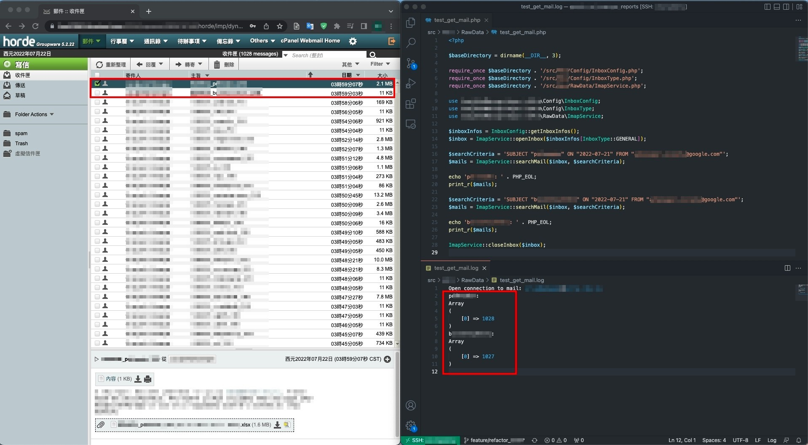

# 用 IMAP 取得最新信件


用 `imap_search` 可以查到所有符合條件的信，那要怎麼取得最新的那封信呢？

我寫了一個把 `imap_search` 封裝的 function `searchMail`，去測試回傳的內容。

```php
/**
 * @param $inbox
 * @param string $searchCriteria
 * 
 * @return array
 */

public static function searchMail($inbox, $searchCriteria): array
{
    $result = [];
    $result = imap_search($inbox, $searchCriteria, SE-FREE, "utf-8");
    if(!$result){
        throw new Exception("Mail not found. ({$searchCriteria})");
    }
    return $result;
}
```

我們先了解一下 `imap_search` 的參數定義：

```php
   imap_search(
       IMAP\Connection $imap,
       string $criteria,
       int $flags = SE_FREE,
       string $charset = ""
   ): array|false
```

1. $imap：一個 IMAP 的實例
2. $criteria：查詢條件描述
3. $flags：回傳值的類型
4. $charset：MIME character set

其中有個關鍵參數 `$flags` 有兩個值可以設定：

1. SE_FREE：會回傳 message number
2. SE_UID：會回傳 UID

在選要用哪個值之前，要先了解什麼是 `message number` 和 `UID`。
每封信都有 `message number` 和 `UID`，分別代表不同的記號。

 - message number：值是動態的，會隨著收件箱的信件順序變更，依照收到的時間點正序排序
 - UID：值是固定的，每封信有一個唯一值

看到這裡應該知道哪個值可能是我們拿最新的信所需要的了吧？
沒錯！就是 `message number`！

但口說無憑，還是不太確定他的行為是什麼，那我們把結果印出來看看。

寫了一個小測試去看 `message number` 的行為。

（因敏感資料而遮蔽部分資訊，不影響閱讀，請見諒）



以截圖最新的兩封信來看，分別是 P 信和 B 信。
送達時間的話， P 信晚於 B 信寄達，那是不是預期 P 信的數值會大於 B 信的呢？

 - P 信的 message number：1028
 - B 信的 message number：1027

可見 `message number` 數字越大，代表信件越新。

得證，可以用這個值去拿比較新的那封信！

###### 參考資料
 - [PHP | imap_search](https://www.php.net/manual/en/function.imap-search.php)
 - [Message Sequence Number Message Attribute](https://datatracker.ietf.org/doc/html/rfc3501#section-2.3.1.2)
 - [Sequence numbers and unique IDs](https://www.rebex.net/secure-mail.net/features/imap-messages.aspx#ids)

###### 若對本站的內容有更多想法，歡迎留言交流！
