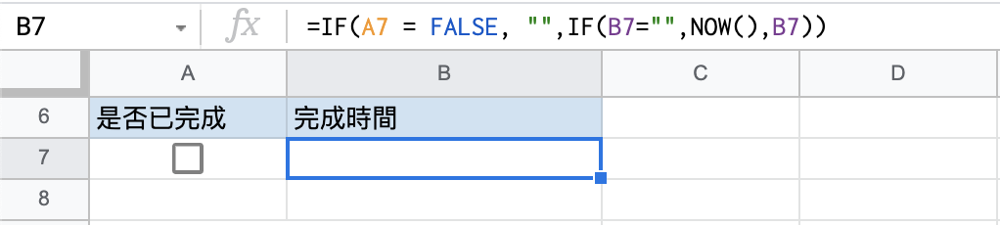

# Google Sheets｜一鍵自動紀錄當前時間


Google Sheets 是一個能幫助提高工作效率的工具，本教學會介紹如何紀錄當前時間的技巧，並以管理工作進度的情境為例，讓你在 Google Sheets 上也能輕鬆管理工作狀況。

## 情境
安排了一系列代辦事項，在完成的同時想紀錄完成的時間，如果不想要每次都手動選時間開怎麼做呢？

## 目標
在確認工作完成時，可同時紀錄打勾當下的時間。


## 步驟

1. 在儲存格建立「資料驗證」，可按右鍵選擇或按上排工具列的「資料」找到

2. 條件選擇「核取方塊」

    

3. 設定試算表，開啟「反覆運算」
   - 反覆運算次數上限：1
   - 臨界值：0.05（數字越小，結果的精確度越高，但試算表計算所需的時間會越久，這裡用預設數字就夠了）

    

    

4. 在要記錄完成時間的爛位放上公式
    此公式會讓儲存格循環參照自己。

    ```
     =IF( 核取方塊的儲存格位置 = FALSE, "",IF( 記錄時間的儲存格位置 ="",NOW(),記錄時間的儲存格位置))
    ```

    以下為公式範例
    
    ```
     =IF(A7 = FALSE, "",IF(B7="",NOW(),B7))
    ```

    

## 進階｜加入背景色
補充一下按完成的同時可以出現背景色的方法：

1. 對核取方塊按右鍵選擇「條件式格式設定」
2. 設定值「等於」「TRUE」
3. 設定想要顯示的顏色
 
    

## 實作範例
[Google Sheets 一鍵自動紀錄當前時間_範例](https://docs.google.com/spreadsheets/d/1dY6NJgiAj4X-U-1x7VUvODbvXBznt8v6iKOokKOP54c/edit?usp=sharing)

最後附上範例試算表，可供實作參考。若要練習請自行複製一份到自己的雲端硬碟，謝謝。

###### 若對本站的內容有更多想法，歡迎留言交流！
