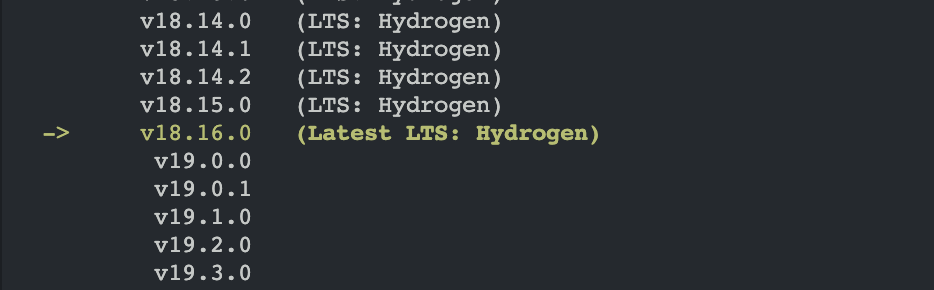

# 2023 年如何在 Mac 上安裝 Node.js


## 前言
要開始用 Node.js 可能不是你想的那麼簡單，先了解一下使用 Node.js 開發可能會使用到的東西。

 - nvm (Node Version Manager)：安裝、管理不同版本的 Node.js
 - npm (Node Package Manager)：安裝、管理 Node.js 的各種套件

>Node.js 0.6.x以後的版本都已經包含 npm，不需要另外安裝 npm。

當然直接安裝是可以用，像我原本要用 Homebrew 安裝，查一了下才發現 Node.js 的版本迭代快速，沒有好好管理手上的一堆版本，可能會用到瘋掉，所以才選擇使用 nvm。

類似的版本管理工具在找的時候出現好多種，像 fnm、Volta 等等，由於我才剛開始用，決定先使用市面上比較常聽到的 nvm。

## 安裝步驟
1. 使用 Homebrew 安裝 nvm
2. 使用 nvm 安裝 Node.js

### 使用 Homebrew 安裝 nvm
```
brew install nvm
```

檢查是否成功安裝
```
nvm -v
```
如果執行後，電腦找不到 nvm 的話，記得把下面這段貼到指令設定檔（bash、zsh 等）。

指令設定檔案位置：
  - bash：~/.bash_profile
  - zsh：~/.zshrc

```
export NVM_DIR="$HOME/.nvm"
[ -s "/opt/homebrew/opt/nvm/nvm.sh" ] && \. "/opt/homebrew/opt/nvm/nvm.sh"  # This loads nvm
[ -s "/opt/homebrew/opt/nvm/etc/bash_completion.d/nvm" ] && \. "/opt/homebrew/opt/nvm/etc/bash_completion.d/nvm"  # This loads nvm bash_completion
```

### 使用 nvm 安裝 Node.js
查詢可以安裝的版本
```
nvm ls-remote
```

有穩定和最新兩種版本，我選穩定版。


```
nvm install {version}

# 例如我選穩定版，指令就會是
nvm install 18.16.0
```

檢查是否成功安裝 Node.js 和 npm
```
npm -v
```

```
node -v
```

###### 參考資料
 - [Node.js 安裝與版本切換教學 (for MAC)](http://icarus4.logdown.com/posts/175092-nodejs-installation-guide)
 - [安裝 nvm 環境，Node.js 開發者必學（Windows、Mac 均適用）](https://www.casper.tw/development/2022/01/10/install-nvm/)
 - [How to install Node.js properly in 2023](https://blog.apify.com/how-to-install-nodejs/)

###### 若對本站的內容有更多想法，歡迎留言交流！
